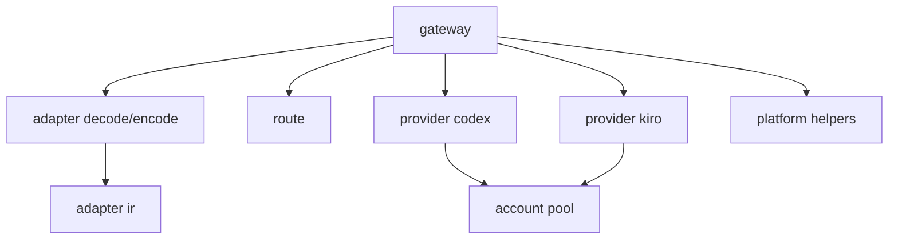

# Feature Design

## Overview

Refactor ini menstandarkan naming file backend dan mengurangi file yang terlalu kecil tanpa mengubah behavior runtime. Pendekatan yang dipilih adalah **merge-by-concern**: file kecil yang satu domain digabung, lalu dinamai ulang dengan pola normal dan konsisten.

Tujuan desain:

- Navigasi kode lebih cepat (nama file mudah ditebak).
- Struktur tetap modular, tapi tidak micro-file.
- Semua perubahan dilakukan bertahap dengan checkpoint compile/test di setiap fase.

## Architecture

Arsitektur package tetap sama di level tinggi (`gateway -> adapter/protocol -> provider -> account/config`), yang berubah adalah naming dan granularity file.



## Target Tree

```text
internal/
├─ gateway/
│  ├─ server.go
│  ├─ openai_handlers.go
│  └─ anthropic_handlers.go
├─ protocol/
│  ├─ openai/
│  │  ├─ requests.go
│  │  ├─ responses.go
│  │  └─ stream.go
│  └─ anthropic/
│     ├─ requests.go
│     ├─ responses.go
│     └─ stream.go
├─ adapter/
│  ├─ ir/
│  │  └─ ir.go
│  ├─ decode/
│  │  ├─ common.go
│  │  ├─ openai.go
│  │  └─ anthropic.go
│  ├─ encode/
│  │  ├─ openai.go
│  │  ├─ anthropic.go
│  │  ├─ openai_stream.go
│  │  └─ anthropic_stream.go
│  └─ rules/
│     └─ rules.go
├─ route/
│  ├─ models.go
│  └─ endpoints.go
├─ provider/
│  ├─ types.go
│  ├─ codex/
│  │  ├─ service.go
│  │  ├─ client.go
│  │  ├─ auth.go
│  │  ├─ quota.go
│  │  └─ runtime.go
│  └─ kiro/
│     ├─ service.go
│     ├─ client.go
│     ├─ auth.go
│     ├─ quota.go
│     └─ runtime.go
├─ account/
│  ├─ account.go
│  └─ pool.go
└─ platform/
   ├─ platform.go
   ├─ http.go
   └─ clock.go
```

## Components and Interfaces

### Gateway

- `server.go` menampung bootstrap server, route constants, shared error writer, context helper.
- `openai_handlers.go` menampung handler OpenAI (`chat/completions`).
- `anthropic_handlers.go` menampung handler Anthropic (`messages`, `count_tokens`).

Interface tidak berubah: method `Start`, `Stop`, `Running`, `BindAddress` tetap di `gateway.Server`.

### Protocol

- `requests.go` menyatukan type/decode request per provider protocol.
- `responses.go` menyatukan response struct.
- `stream.go` menyatukan struct event/stream SSE.

Kontrak JSON request/response tetap sama.

### Adapter

- `ir/ir.go` jadi satu sumber IR contract (`Request`, `Response`, `Event`, `ToolCall`, dsb).
- `decode/openai.go` dan `decode/anthropic.go` memetakan request protocol -> IR.
- `encode/openai.go` dan `encode/anthropic.go` memetakan IR -> response protocol.
- `rules/rules.go` menggabungkan validasi capability/tool/thinking agar tidak tersebar.

### Provider

- `runtime.go` di masing-masing provider menggabungkan file-file kecil runtime parser/mapper/executor.
- `service.go`, `client.go`, `auth.go`, `quota.go` tetap dipisah karena boundary tanggung jawabnya jelas.

### Account dan Platform

- `account/account.go` menggabungkan type alias + validation + store wrapper ringan.
- `platform/platform.go` menggabungkan helper network/error/log yang kecil.

## Rename and Merge Strategy

1. **Merge dahulu, rename setelahnya** di domain yang sama untuk meminimalkan broken imports.
2. Gunakan nama normal berbasis domain (`openai_handlers.go`, `requests.go`, `runtime.go`).
3. Standarkan alias import lintas package:
   - `provider` untuk `internal/provider`
   - `codexprovider` untuk `internal/provider/codex`
   - `kiroprovider` untuk `internal/provider/kiro`
4. Hindari alias campuran yang maknanya sama.

## Data Models

Tidak ada perubahan schema runtime JSON (`config.json`, `accounts.json`, `stats.json`).

Data model yang berubah hanya model kode internal (penggabungan deklarasi lintas file), dengan kontrak type tetap:

- `adapter/ir` tetap menyediakan IR structs yang sama.
- `provider.CompletionOutcome` dan `provider.ToolUse` tetap kompatibel.

## Error Handling

Risiko utama adalah compile break karena symbol move/rename. Strategi mitigasi:

1. Refactor per fase dan jalankan compile segera setelah fase selesai.
2. Jika import/path rusak, perbaiki dalam fase yang sama (tidak ditunda).
3. Jangan mencampur behavior change dengan rename change.

## Testing Strategy

Validation dilakukan setelah setiap fase:

1. `go test ./internal/...`
2. `go test .`
3. `wails build` (minimal setelah fase besar dan final)

Kriteria selesai:

- Seluruh phase checkpoint lolos.
- Endpoint behavior tidak berubah (OpenAI + Anthropic bridge tetap berjalan).
- Tidak ada reference ke nama file lama.
