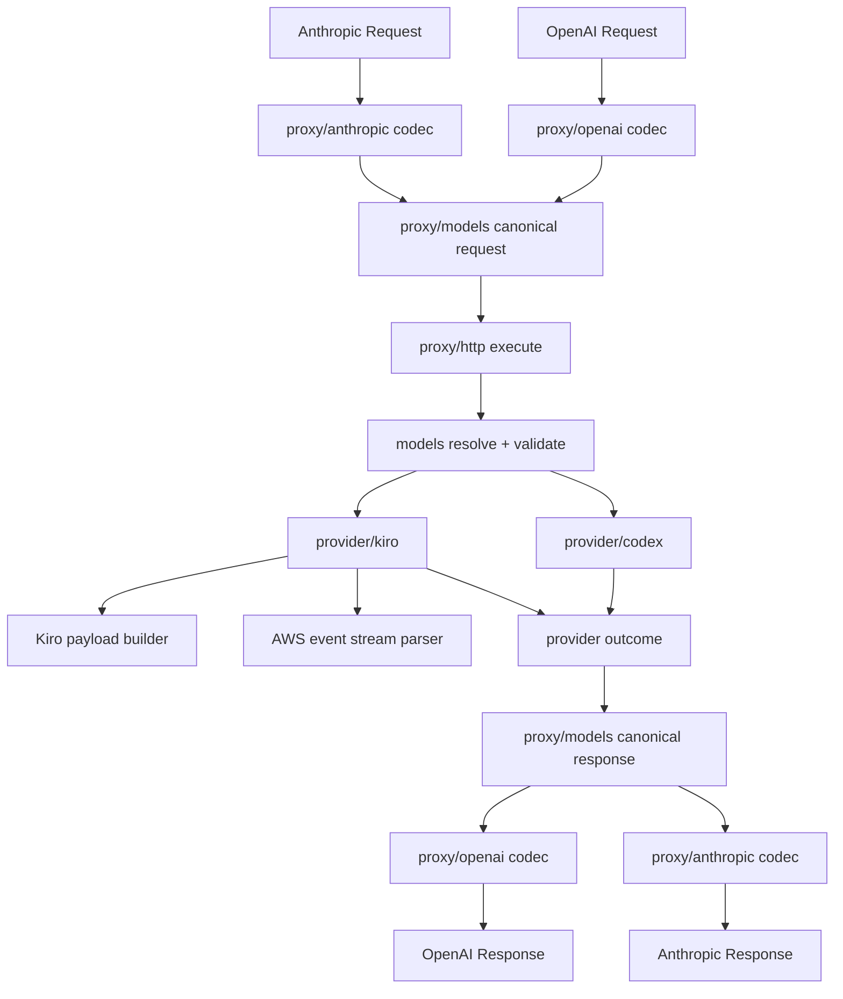

# Feature Design

## Overview

CLIRO already has the right outer architecture for a multi-protocol desktop proxy: protocol codecs live under `internal/proxy/`, provider adapters live under `internal/provider/`, account/auth state lives under `internal/auth/`, and persistent settings/state live under `internal/config/`. The missing piece is not a new server architecture. The missing piece is a reliable Kiro execution adapter with protocol parity comparable to the existing Codex path.

The design keeps CLIRO's current package boundaries and strengthens them instead of introducing a new generic abstraction layer.

Core design decisions:

- Keep `internal/proxy/openai` and `internal/proxy/anthropic` as protocol-specific codec packages.
- Keep `internal/proxy/models` as the single canonical request/response shape for the proxy layer.
- Keep `internal/provider/codex` and `internal/provider/kiro` as provider adapters.
- Do not reintroduce a protocol-neutral `contract` layer.
- Improve reliability by making conversion deterministic, typed, and validated before provider execution.

The design is intentionally conservative: fewer folders, no new top-level abstractions, but stronger typing and stricter invariants.

## Architecture



### Data Flow

1. `proxy/openai` or `proxy/anthropic` decodes inbound protocol payloads into canonical request structures.
2. `proxy/models` resolves model/provider and validates request invariants.
3. `proxy/http` routes execution to `provider/codex` or `provider/kiro`.
4. `provider/kiro` converts canonical requests to Kiro payloads, calls runtime hosts, parses AWS event streams, and emits a provider outcome.
5. `proxy/http` converts provider outcomes into canonical responses.
6. `proxy/openai` and `proxy/anthropic` encode canonical responses into outward protocol shapes.

## Components and Interfaces

### `internal/proxy/models`

Purpose:
- Own the canonical request/response model used by proxy execution.
- Own model resolution, provider routing, validation rules, thinking signatures, and tool argument remapping.

Responsibilities:
- Canonical types for request, message, content, thinking, image, tool, tool result, usage, response.
- `ResolveModel()` and provider selection.
- Validation of canonical invariants before provider execution.
- Kiro/Codex model catalog entries surfaced through `/v1/models`.

Interface surface:
- `Request`
- `Response`
- `ResolveModel(...)`
- `ValidateRequest(...)`
- `CatalogModels()`
- `StableThinkingSignature(...)`

### `internal/proxy/openai`

Purpose:
- Decode OpenAI requests into canonical request structures.
- Encode canonical responses/events into OpenAI-compatible outputs.

Responsibilities:
- Normalize `chat.completions`, `responses`, and `completions` requests.
- Normalize OpenAI text/image/tool/reasoning blocks into canonical message/content structures.
- Encode canonical responses, usage, stop reasons, tool calls, and thinking back into OpenAI-compatible output.

Reliability goals:
- No silent loss of text, tool, image, or reasoning information.
- Stable response IDs and finish reasons.

### `internal/proxy/anthropic`

Purpose:
- Decode Anthropic requests into canonical request structures.
- Encode canonical responses/events into Anthropic-compatible outputs.

Responsibilities:
- Normalize Anthropic system/messages content.
- Preserve image blocks, tool_use, tool_result, and thinking blocks.
- Encode canonical responses into Anthropic text/thinking/tool_use blocks.

Reliability goals:
- Preserve Anthropic content semantics without OpenAI-specific leakage.
- Maintain consistent stop reasons and usage.

### `internal/proxy/http`

Purpose:
- Own routing and execution orchestration.

Responsibilities:
- Prepare execution requests.
- Resolve provider/model.
- Call provider adapters.
- Convert provider outcomes into canonical responses.
- Log routing, thinking, fallback, and completion details.

Interface surface:
- `executeRequest(ctx, request)`
- HTTP route handlers

### `internal/provider/codex`

Purpose:
- Execute canonical requests against Codex upstreams.

Responsibilities:
- Convert canonical requests into Codex runtime payloads.
- Parse Codex upstream responses.
- Emit provider outcomes.

Design note:
- Codex remains the maturity baseline. Kiro should be brought up to comparable behavior, not vice versa.

### `internal/provider/kiro`

Purpose:
- Execute canonical requests against Kiro runtime hosts with high protocol fidelity.

Responsibilities:
- Convert canonical requests to Kiro payloads.
- Apply Kiro runtime host fallback.
- Parse AWS event stream responses.
- Reconstruct text, thinking, tool calls, and usage.
- Emit provider outcomes compatible with canonical response mapping.

Internal files:
- `service.go` - provider lifecycle, account selection, failure handling
- `execute.go` - runtime request execution and host fallback
- `payload.go` - canonical request -> Kiro payload conversion
- `stream.go` - AWS event-stream parsing and reconstruction
- `quota.go` - quota fetch path

## Data Models

### Canonical Request Model

The canonical request model should stop relying on open-ended `any` payloads wherever avoidable. The current `models.Request` and `models.Message` are the right ownership point, but they need stronger typing for content blocks.

Proposed direction:

```go
type ContentBlock struct {
    Type string // text, image, tool_result, thinking
    Text string
    Image *ImageBlock
    ToolResult *ToolResultBlock
    Thinking *ThinkingBlock
}

type ImageBlock struct {
    MediaType string
    Data string
    URL string
}

type ToolResultBlock struct {
    ToolCallID string
    Content string
    IsError bool
}

type ThinkingState struct {
    Requested bool
    Effort string
    BudgetTokens int
    RawParams map[string]any
}
```

This is not a new package. It belongs in `internal/proxy/models`.

### Canonical Response Model

Canonical response shape remains in `internal/proxy/models`, but should gain enough structure to represent:

- assistant text
- parsed thinking
- thinking signature/source
- tool calls
- usage
- stop reason

Optional future improvement:
- a canonical streaming event type separate from final response shape

### Kiro Payload Model

`internal/provider/kiro/payload.go` owns provider-specific structures.

Key payload elements:
- `conversationState.chatTriggerType`
- `conversationState.conversationId`
- `conversationState.currentMessage.userInputMessage`
- `conversationState.history`
- `profileArn`

The payload builder must preserve:
- system prompt additions
- prior history ordering
- tool definitions
- tool results
- images
- metadata continuity (`conversationId`, `continuationId`, `profileArn`)

### Kiro Stream Event Model

The parser should aggregate AWS event-stream frames into typed internal events before building final completion outcomes.

Proposed internal event model:

```go
type KiroEvent struct {
    Kind string // text, thinking, tool_start, tool_delta, tool_end, usage, done, error
    Text string
    ToolID string
    ToolName string
    ToolInputFragment string
    Usage models.Usage
    Err error
}
```

This should stay internal to `internal/provider/kiro/stream.go`.

## Reliability Strategy

### 1. Typed Normalization Before Execution

All inbound protocol requests must be normalized into the same canonical model before provider payload generation.

This reduces duplication and ensures:
- one validation path
- one provider routing path
- one response reconstruction target

### 2. Deterministic Kiro Payload Generation

Kiro payload generation must stop being best-effort where avoidable.

Rules:
- canonical system content always folds into a composed system prompt
- current user message always becomes `currentMessage.userInputMessage`
- prior history always becomes ordered `history`
- tool results attach to the correct message context
- image conversion only accepts supported forms and preserves media types

### 3. Event-Driven Stream Reconstruction

Kiro stream parsing should reconstruct provider output via typed state transitions:
- accumulate text deltas
- accumulate thinking deltas
- accumulate tool call input fragments
- finalize tool calls only when complete or stream ends
- normalize usage keys across event variants

### 4. Fallback Runtime Hosts

Kiro execution should try hosts in a fixed order:

1. `https://q.us-east-1.amazonaws.com/generateAssistantResponse`
2. `https://codewhisperer.us-east-1.amazonaws.com/generateAssistantResponse`

Fallback should trigger on:
- transport errors
- parse errors
- upstream non-2xx status failures

### 5. Explicit Failure Classification

All Kiro runtime failures should map into existing provider failure classes rather than generic fallback strings.

Important mappings:
- auth refreshable
- quota cooldown
- request shape / malformed payload
- empty output
- malformed stream
- provider fatal

## Error Handling

### Request Validation Errors

Handled in `internal/proxy/models`:
- malformed tool/tool_result/image/thinking combinations
- unsupported provider/endpoint combinations
- invalid model routing

Returned as client-facing `400` errors.

### Provider Runtime Errors

Handled in `internal/provider/kiro/service.go` and `execute.go`:
- transport failure
- auth failure
- quota failure
- runtime host failure
- stream parse failure
- empty visible output

Mapped into provider failure decisions and account-state updates.

### Stream Parse Errors

Handled in `internal/provider/kiro/stream.go`:
- malformed AWS frame
- malformed JSON event
- malformed tool JSON
- missing usage/finalization indicators

Design rule:
- never silently convert malformed provider output into a successful empty response

## Logging and Observability

Structured logs should include:

- protocol
- endpoint
- requested model
- resolved model
- provider
- account label / account id
- thinking requested/emitted
- tool count
- image count
- runtime host used
- fallback attempted yes/no
- usage fields
- failure class

Key log points:
- request normalized
- request routed
- payload host attempt
- fallback host attempt
- provider completion
- provider failure
- stream parse failure

## Testing Strategy

Current repo intentionally has test files removed, so the design assumes validation will be reintroduced later in a focused way.

Recommended validation layers when tests return:

### Unit-Level
- OpenAI request normalization
- Anthropic request normalization
- canonical model validation
- Kiro payload generation
- Kiro stream event reconstruction
- stop reason / usage mapping

### Integration-Level
- OpenAI -> Kiro -> OpenAI
- OpenAI -> Kiro -> Anthropic
- Anthropic -> Kiro -> OpenAI
- Anthropic -> Kiro -> Anthropic

### Live Validation Checklist
- basic text completion
- thinking-enabled completion
- tool call request
- tool result continuation
- image input request
- runtime fallback host exercise
- malformed response handling

## Implementation Notes

### Files to Change First

- `internal/proxy/models/resolve.go`
- `internal/proxy/openai/codec.go`
- `internal/proxy/anthropic/codec.go`
- `internal/provider/kiro/payload.go`
- `internal/provider/kiro/stream.go`
- `internal/proxy/http/execute.go`

### Files to Change Later

- `internal/provider/codex/payload.go`
- `internal/provider/codex/execute.go`
- `internal/provider/health.go`
- `internal/proxy/http/routes.go`

## Design Summary

This design does not replace CLIRO's architecture. It strengthens it.

- `proxy/models` becomes the strict canonical shape owner.
- `proxy/openai` and `proxy/anthropic` stay protocol codecs.
- `provider/kiro` becomes a deterministic provider adapter instead of a heuristic bridge.
- Kiro runtime fallback, thinking, tools, images, and stream parsing are hardened without adding new architecture layers.

The result is a cleaner path to high-confidence OpenAI/Anthropic parity with Kiro while keeping ownership simple and maintainable.
