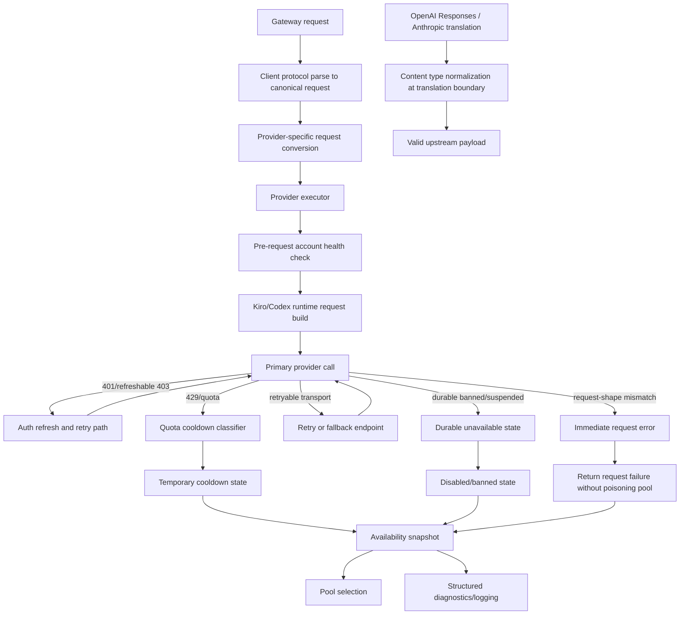

# Feature Design

## Overview

This design fixes three related failure classes in the current backend:

1. Provider pools drain too aggressively after recoverable failures, causing `no available codex accounts` and `no available kiro accounts` even when the situation is temporary.
2. Kiro runtime requests do not yet match the proven reference behavior closely enough, especially around endpoint/header parity, auth retry behavior, and `profileArn` handling.
3. Cross-protocol translation still emits incompatible OpenAI Responses content types into Anthropic-facing paths, producing upstream validation errors like `Invalid value: 'input_text'. Supported values are: 'output_text' and 'refusal'.`

The implementation should follow the same architectural direction used in `z_references/CLIProxyAPI-Extended` rather than only patching scattered request handlers. In the reference, the stable path is:

- request parsing into canonical/unified IR,
- provider-specific request conversion from IR,
- executor-level retry/auth/fallback logic,
- response translation back out of IR/protocol-specific format.

For correctness, the current app should adapt that separation where it directly maps to our codebase:

- Kiro runtime parity should be driven primarily by the reference executor and `translator_new/from_ir/kiro.go` behavior.
- Codex request correctness should be driven by the stricter Responses conversion in `translator_new/from_ir/codex.go`.
- protocol normalization bugs should be fixed near translation boundaries, not buried in late-stage gateway response writing.

## Architecture



## Components and Interfaces

### 1) Provider Availability Classification (`internal/config`, `internal/account`, provider services)

Introduce explicit provider-account availability classes instead of overloading `enabled`, `cooldownUntil`, and `lastError` for every situation.

Proposed state model on account records:

```go
type AccountHealthState string

const (
    AccountHealthReady             AccountHealthState = "ready"
    AccountHealthCooldownQuota     AccountHealthState = "cooldown_quota"
    AccountHealthCooldownTransient AccountHealthState = "cooldown_transient"
    AccountHealthDisabledDurable   AccountHealthState = "disabled_durable"
    AccountHealthBanned            AccountHealthState = "banned"
)
```

Additional account metadata:

```go
type Account struct {
    // existing fields...
    HealthState   AccountHealthState `json:"healthState,omitempty"`
    HealthReason  string             `json:"healthReason,omitempty"`
    LastFailureAt int64              `json:"lastFailureAt,omitempty"`
}
```

Why:
- temporary request/header/auth failures should not look the same as durable bans.
- pool diagnostics need a stable classification that explains why an account is unavailable.

### 2) Provider Failure Classifier (`internal/provider`, shared helper package or provider-local helpers)

Add a small classification layer used by both Codex and Kiro services.

```go
type FailureClass string

const (
    FailureRetryableTransport FailureClass = "retryable_transport"
    FailureAuthRefreshable    FailureClass = "auth_refreshable"
    FailureQuotaCooldown      FailureClass = "quota_cooldown"
    FailureDurableDisabled    FailureClass = "durable_disabled"
    FailureRequestShape       FailureClass = "request_shape"
    FailureProviderFatal      FailureClass = "provider_fatal"
)

type FailureDecision struct {
    Class          FailureClass
    Message        string
    Cooldown       time.Duration
    DisableAccount bool
    BanAccount     bool
    RetryAllowed   bool
}
```

Why:
- current logic classifies too many failures as account-level unavailability.
- request-shape mismatches should fail the request, not poison the account.

### 3) Pool Availability Reporting (`internal/account/pool.go`)

Extend pool logic to:
- skip banned/durably disabled accounts,
- skip temporary cooldown accounts until expiry,
- expose richer availability counters for diagnostics:

```go
type AvailabilitySnapshot struct {
    ReadyCount             int `json:"readyCount"`
    CooldownQuotaCount     int `json:"cooldownQuotaCount"`
    CooldownTransientCount int `json:"cooldownTransientCount"`
    DisabledDurableCount   int `json:"disabledDurableCount"`
    BannedCount            int `json:"bannedCount"`
}
```

Why:
- `provider_unavailable` needs explanation.
- the UI and logs should show whether the pool is empty because of quota, transient auth, or durable failures.

### 4) Canonical Translation Boundary (`internal/adapter/*`, `internal/protocol/*`, gateway request parsing)

The image and reference layout point to a stronger separation than the current app has today:

- `internal/translator_new/to_ir/openai.go`
- `internal/translator_new/from_ir/kiro.go`
- `internal/translator_new/from_ir/codex.go`
- `internal/translator_new/sdk_adapter.go`

The spec should treat these as the source of truth for parity work. In our app, we do not need to clone the exact package structure, but the logic should be moved toward the same boundaries:

- parse incoming OpenAI/Anthropic payloads into a canonical request form with preserved metadata,
- convert canonical requests into provider-specific payloads,
- normalize protocol-specific content types before they ever reach provider executors,
- keep executor logic focused on auth/retry/runtime transport behavior rather than ad-hoc payload surgery.

This matters for both the Anthropic `input_text` bug and Kiro continuation/profile metadata.

### 5) Kiro Runtime Parity Layer (`internal/provider/kiro`)

Add a request-context builder that mirrors the reference behavior more closely.

```go
type kiroRequestContext struct {
    Account            config.Account
    APIRole            string
    Origin             string
    UseFallback        bool
    APIRegion          string
    EffectiveProfileARN string
    ConversationID     string
    ContinuationID     string
}
```

Responsibilities:
- choose primary Q endpoint vs fallback CodeWhisperer endpoint,
- omit `X-Amz-Target` on primary Q endpoint,
- add `X-Amz-Target` only on fallback endpoint,
- apply static/dynamic runtime headers consistently,
- compute effective `profileArn` injection rules,
- preserve continuation/conversation metadata when supplied by the client or request metadata,
- retry on token-related `401` and selected `403` failures before updating account health.

#### `profileArn` Rules

Adopt the reference principle:
- some auth modes require `profileArn`,
- some auth modes should suppress `profileArn` because sending it causes `403`.

Given the current project scope (`kiro` device auth only), the design should still keep the rule explicit instead of hardcoding raw request injection everywhere.

```go
func effectiveKiroProfileARN(account config.Account) string
```

This helper decides whether to include `account.AccountID` (used as `profileArn`) in the runtime payload/body.

### 6) Codex Request and Availability Parity (`internal/provider/codex`, request conversion path)

Codex should adopt the same failure classification model as Kiro, but the request-construction side also needs to follow the stricter reference conversion in `translator_new/from_ir/codex.go`.

Behavior changes:
- token-refreshable failures should prefer refresh/retry,
- quota failures should become quota cooldowns,
- request/translation errors should not disable accounts,
- provider pool errors should aggregate account-state reasons in logs.
- Codex upstream request shaping should remain strict about fields the upstream accepts or rejects.

### 7) Translation Normalization (`internal/adapter/decode`, `internal/adapter/encode`, possibly `internal/protocol`)

The failing case indicates our Anthropic-facing path is receiving OpenAI Responses-style parts with unsupported text subtype placement.

Add explicit normalization helpers near the translation layer rather than in late executor/gateway code:

```go
func NormalizeAnthropicContentParts(parts []any, role string, phase string) []any
func NormalizeOpenAIResponsesInput(input any) any
```

Target behavior:
- assistant-side emitted content for Anthropic compatibility must use the Anthropic-accepted text representation,
- OpenAI Responses input items may retain `input_text` on OpenAI-facing request boundaries, but must not survive unmodified into Anthropic upstream payloads where only `output_text`/`refusal` are valid for that position,
- tool call / tool result semantics must remain intact.

### 8) Gateway Diagnostics (`internal/gateway`)

Enhance request-failure logging so `provider_unavailable` responses include reason summaries.

Proposed helper:

```go
func buildProviderUnavailableReason(provider string, snapshot account.AvailabilitySnapshot) string
```

Example output:
- `no available kiro accounts (ready=0 cooldown_quota=1 cooldown_transient=2 banned=0 durable_disabled=0)`

Why:
- makes 503s actionable without digging through unrelated logs.

## Data Models

### Account Health State

```go
type AccountHealthState string

const (
    AccountHealthReady             AccountHealthState = "ready"
    AccountHealthCooldownQuota     AccountHealthState = "cooldown_quota"
    AccountHealthCooldownTransient AccountHealthState = "cooldown_transient"
    AccountHealthDisabledDurable   AccountHealthState = "disabled_durable"
    AccountHealthBanned            AccountHealthState = "banned"
)
```

### Provider Failure Decision

```go
type FailureDecision struct {
    Class          FailureClass
    Message        string
    Cooldown       time.Duration
    DisableAccount bool
    BanAccount     bool
    RetryAllowed   bool
}
```

### Pool Availability Snapshot

```go
type AvailabilitySnapshot struct {
    ReadyCount             int `json:"readyCount"`
    CooldownQuotaCount     int `json:"cooldownQuotaCount"`
    CooldownTransientCount int `json:"cooldownTransientCount"`
    DisabledDurableCount   int `json:"disabledDurableCount"`
    BannedCount            int `json:"bannedCount"`
}
```

## Error Handling

### Recoverable Auth Errors
- attempt token refresh and retry once,
- only mark account temporarily unavailable if refresh fails and the error is still account-specific,
- if the failure looks request-shape/header-related, do not poison the account.

### Quota / Rate Limit Errors
- move account into quota-specific cooldown,
- preserve account as healthy again after cooldown expiry,
- do not ban/disable for quota exhaustion.

### Durable Disabled / Banned Errors
- set durable state only on clear revoked/suspended/banned signals,
- keep reason text normalized and explicit.

### Protocol Translation Errors
- fail request with a clear gateway error,
- do not update account health,
- log the incompatible content normalization failure path.

### Provider Unavailable Errors
- return protocol-appropriate `provider_unavailable`,
- include richer availability-state diagnostics in logs and optionally in debug-oriented UI fields.

## Testing Strategy

### Unit Tests
- canonical parse/convert parity:
  - preserve `conversationId` and `continuationId`
  - preserve/normalize Responses input items correctly
  - Codex strict request shaping parity with reference
- Kiro request builder:
  - primary endpoint omits `X-Amz-Target`
  - fallback endpoint includes correct target
  - `profileArn` inclusion/suppression rules
- failure classifier:
  - token-related 401/403
  - quota 429
  - transport retryable
  - request-shape mismatch
  - durable disabled/banned cases
- translation normalization:
  - `input_text` -> valid Anthropic-facing representation
  - no valid content loss

### Integration-like Provider Tests
- Kiro request flow retries after refreshable auth failure without draining the pool.
- Codex request flow uses cooldown instead of disable for quota/transient failures.
- pool availability snapshot reflects mixed temporary/durable states correctly.

### Gateway Tests
- `provider_unavailable` only when all provider accounts are actually unavailable.
- reason summary includes availability counts.
- Anthropic route no longer emits invalid `input_text` payloads.

### Regression Tests
- explicit regression for:
  - `503 {"error":{"message":"no available codex accounts"...}}`
  - `503 {"error":{"message":"no available kiro accounts"...}}`
  - `Invalid value: 'input_text'. Supported values are: 'output_text' and 'refusal'.`
