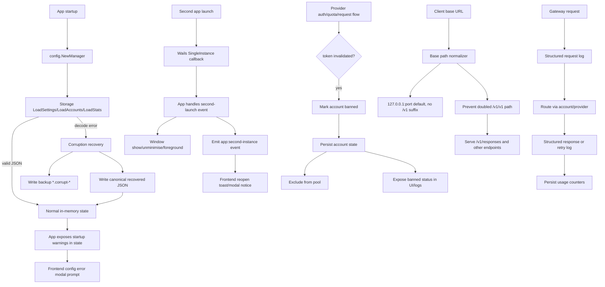

# Feature Design

## Overview

This design introduces five runtime-hardening tracks and one UX track:

1. Corrupt config recovery without backward format parsing.
2. Reliable corruption-focused tests.
3. Banned account detection for token-invalidated credentials.
4. Request routing observability with structured usage logs.
5. API router security and path correctness, including `/responses`.
6. Single-instance second-launch foreground restore with in-app notice.

The implementation keeps canonical file formats strict (`config.json`, `accounts.json` as array, `stats.json`) while making decode failures recoverable through quarantine + rewrite. The app must not panic on malformed JSON.

## Architecture



## Components and Interfaces

### 1) Config Recovery Layer (`internal/config/storage.go`)

- Keep one canonical parser per file.
- Add shared corruption recovery helper for decode failures.
- Recovery action per file:
  - `config.json` -> default `AppSettings`.
  - `accounts.json` -> empty `[]Account`.
  - `stats.json` -> zero `ProxyStats`.
- Recovery behavior:
  - Persist backup of corrupted bytes (`<file>.corrupt-<timestamp>`).
  - Rewrite original file with canonical JSON.
  - Return fallback value plus structured warning.

### 2) Config Manager Warning Surface (`internal/config/config.go`)

- Extend manager load flow to collect startup recovery warnings.
- Provide immutable getter for startup warnings (for app state serialization).
- Preserve existing thread-safety with `sync.RWMutex`.

### 3) App Startup Safety + UI Warning Bridge (`app.go`)

- Remove panic-prone startup assumptions around config decode failures.
- Keep runtime alive even when recoverable file issues happen.
- Include startup warnings in `GetState()` payload so frontend can display one-time configuration error modal content.

### 4) Single-Instance Foreground Restore (`main.go`, `app.go`)

- Keep existing `SingleInstanceLock`.
- Add `OnSecondInstanceLaunch` callback:
  - Unminimise/show existing window.
  - Apply foreground nudge (always-on-top toggle or equivalent Wails-safe focus sequence).
  - Emit backend event payload (`app:second-instance`) for user notification and diagnostics.

### 5) Banned Account Classification (`internal/provider/*`, `internal/account`, `internal/config`)

- Detect provider responses that represent token invalidation or revoked access.
- Normalize those signals into a banned-account classification instead of a transient cooldown/auth refresh path.
- Persist banned state and banned reason on the account record.
- Ensure account pool skips banned accounts during provider selection.

### 6) Request Observability (`internal/gateway`, `internal/provider`, `internal/logger`, `internal/config`)

- Emit structured logs for request lifecycle stages:
  - request accepted
  - account/provider selected
  - retry attempt
  - request completed
  - request failed
- Log fields should include:
  - request ID
  - route family / endpoint
  - provider
  - account ID or safe account label
  - model
  - prompt/completion/total token usage when available
  - latency / status / failure reason
- Reuse existing logger infrastructure and keep secret-bearing values redacted.
- Keep usage logs aligned with account/global stats mutation points.

### 7) API Router Path and Security Handling (`internal/gateway`, `internal/route`, frontend API router UI)

- Keep actual served routes OpenAI-compatible under `v1`, including new `POST /v1/responses` support.
- Keep displayed default base URL as `http://127.0.0.1:<port>` without `/v1` suffix.
- Add path normalization helper so user-provided base URLs or overrides do not produce doubled `v1/v1` segments.
- Harden request header handling:
  - normalize authorization-related headers
  - validate header combinations relevant to proxy auth/security mode
  - reject malformed or conflicting header states with clear protocol errors

### 8) Frontend Notice Handler (`frontend/src/App.svelte`)

- Subscribe to `app:second-instance` event via `EventsOn`.
- Show info toast: app is already running and window restored.
- On initial load, display startup corruption recovery warnings in a modal prompt (aggregated list when multiple warnings exist).
- Expose banned account status/reason through existing account views so suspected banned accounts are obvious.

### 9) Configuration Error Modal (`frontend/src/components/common/ConfigurationErrorModal.svelte`)

- Add a dedicated modal component for startup configuration recovery issues.
- Modal payload fields:
  - file path
  - backup file path
  - concise recovery message
- Modal interaction behavior:
  - appears once after initial state fetch if warnings are present
  - user dismisses with explicit action (e.g., "Understood")
  - dismissal does not block normal app usage

## Data Models

### Startup Recovery Warning

```go
type StartupWarning struct {
    Code       string `json:"code"`
    FilePath   string `json:"filePath"`
    BackupPath string `json:"backupPath,omitempty"`
    Message    string `json:"message"`
}
```

### Second Launch Notice Event Payload

```go
type SecondLaunchNotice struct {
    Message          string   `json:"message"`
    Args             []string `json:"args,omitempty"`
    WorkingDirectory string   `json:"workingDirectory,omitempty"`
    ReceivedAt       int64    `json:"receivedAt"`
}
```

### App State Extension

```go
type State struct {
    // existing fields...
    StartupWarnings []config.StartupWarning `json:"startupWarnings,omitempty"`
}
```

### Account Status Extension

```go
type Account struct {
    // existing fields...
    Banned       bool   `json:"banned"`
    BannedReason string `json:"bannedReason,omitempty"`
}
```

### Request Log Payload

```go
type RequestLogContext struct {
    RequestID        string `json:"requestId"`
    RouteFamily      string `json:"routeFamily"`
    Provider         string `json:"provider"`
    AccountID        string `json:"accountId,omitempty"`
    AccountLabel     string `json:"accountLabel,omitempty"`
    Model            string `json:"model,omitempty"`
    PromptTokens     int64  `json:"promptTokens,omitempty"`
    CompletionTokens int64  `json:"completionTokens,omitempty"`
    TotalTokens      int64  `json:"totalTokens,omitempty"`
    LatencyMs        int64  `json:"latencyMs,omitempty"`
    Status           string `json:"status,omitempty"`
    ErrorReason      string `json:"errorReason,omitempty"`
}
```

### Frontend Modal View Model

```ts
interface StartupWarningView {
  code: string
  filePath: string
  backupPath?: string
  message: string
}
```

## Error Handling

- **Decode errors** (`json.Unmarshal`):
  - Treated as corruption.
  - Quarantine original file.
  - Rewrite canonical fallback file.
  - Continue startup.
- **Missing file errors** (`os.ErrNotExist`):
  - Use existing defaults; no corruption warning.
- **Write/backup failures during recovery**:
  - Return detailed error context.
  - App startup logs explicit message and degrades gracefully without abrupt panic where possible.
  - Frontend still surfaces a configuration error modal when warning payload is available.
- **Strict format policy**:
  - `accounts.json` root must be JSON array.
  - Legacy envelopes are not parsed as valid.
  - If present, treated as corruption and handled by recovery pipeline.
- **Banned account detection**:
  - Token invalidated / auth revoked provider responses are treated as durable account failure.
  - Durable failure marks the account as banned with a persisted reason.
  - Banned accounts are skipped by rotation and surfaced clearly in UI/logging.
- **Request observability**:
  - Request logs are emitted at selection, retry, completion, and failure boundaries.
  - Sensitive credentials are never included in logs.
  - Logged token usage must match persisted counters.
- **Router path and security correctness**:
  - UI-visible base URL stays at `127.0.0.1:<port>` by default.
  - Path normalization prevents doubled `/v1/v1` segments.
  - Header validation rejects malformed/conflicting request security state with protocol-appropriate errors.

## Testing Strategy

### Unit/Integration-like File Tests (`internal/config`)

- Replace brittle single-case tests with table-driven coverage:
  - malformed settings JSON
  - malformed accounts JSON
  - malformed stats JSON
  - non-array `accounts.json` root
- Assert:
  - manager/storage load does not panic
  - fallback values are returned
  - backup corruption file is created
  - rewritten file is canonical JSON for expected type

### App-Level Behavior Tests (`main/app package`)

- Add tests for pure helper(s) used by second-instance callback (payload shaping, message text).
- Add tests for startup warning serialization into `State` snapshot and modal data completeness.

### Provider / Account Status Tests

- Add tests for provider error classification that distinguish transient auth failure from token invalidated / banned signals.
- Add tests verifying banned accounts are persisted and skipped by pool selection.

### Gateway / Router Tests

- Add tests for structured request logging around success, retry, and failure flows.
- Add tests verifying logged token usage matches persisted request/account stats updates.
- Add tests for `/v1/responses` route handling.
- Add tests for base URL/path normalization so `/v1/v1` is never generated from displayed defaults or overrides.
- Add tests for security/header validation and rejection behavior.

### Regression Coverage

- Keep strict test asserting no legacy envelope parser branch is used as backward compatibility.
- Add smoke test command sequence to CI/local verification:
  - `go test ./internal/config`
  - `go test ./internal/...`
  - `go test .`
